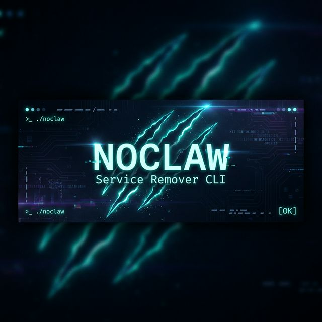

<p align="center">
  
</p>

<h3 align="center">🐾 Interactive CLI for detecting and removing Claw agents from Linux systems</h3>

<p align="center">
  
  
  
  
</p>

<p align="center">
  <a href="#-features">Features</a> •
  <a href="#-quick-start">Quick Start</a> •
  <a href="#-usage-guide">Usage Guide</a> •
  <a href="#-supported-agents">Supported Agents</a> •
  <a href="#-examples">Examples</a> •
  <a href="#-development">Development</a>
</p>

---

## ✨ Features

| Feature | Description |
|---------|-------------|
| 🔍 **Auto-Detection** | Scans your entire system for installed Claw agents on launch |
| 🗑️ **Safe Removal** | Confirmation prompt before every destructive operation |
| ✅ **Double Verification** | Post-removal check confirms resources are truly gone |
| 🔄 **Idempotent** | Run multiple times safely — reports "Already Clean" when done |
| 🎨 **Interactive UI** | Beautiful prompts, spinners, and color-coded status |
| 🔒 **Root Enforcement** | Verifies sudo privileges before any operation |

---

## 🚀 Quick Start

### Install from npm

```bash
npm install -g noclaw
```

### Or build from source

```bash
git clone https://github.com/your-username/noclaw.git
cd noclaw
bun install
bun run build      # → standalone binary
sudo ./noclaw
```

---

## 📖 Usage Guide

### Basic Usage

```bash
# Run with sudo (required for system operations)
sudo noclaw
```

### What Happens When You Run It

```
┌  🐾 Noclaw — Service Remover
│
◆  Select a service to uninstall:
│  ● OpenClaw     — installed & running
│  ○ IronClaw     — installed, not running
│  ○ NanoClaw     — not found
│  ○ PicoClaw     — not found
│  ○ Legacy (Clawdbot/Moltbot) — not found
│  ○ Exit
└
```

### Step-by-Step Flow

**Step 1** — Noclaw scans your system and detects all agents:
```
◆  Select a service to uninstall:
│  ● OpenClaw  —  installed & running     ← found and active
│  ○ IronClaw  —  installed, not running  ← found but stopped
│  ○ NanoClaw  —  not found               ← clean
```

**Step 2** — Select an agent and confirm removal:
```
◇  Remove OpenClaw from this system?
│  Yes
```

**Step 3** — Watch the removal process:
```
◇  Stopping openclaw service…
│  ✔ Service stopped.
◇  Disabling openclaw service…
│  ✔ Service disabled.
◇  Removing service file…
│  ✔ Service file removed.
◇  Reloading systemd daemon…
│  ✔ Daemon reloaded.
◇  Removing binary, modules, and config…
│  ✔ Files removed.
```

**Step 4** — Automatic verification:
```
✔  Verification passed — resource fully removed.   ← All clean!
```

Or if something went wrong:
```
✖  Removal failed: Files still exist.              ← Needs attention
```

**Step 5** — Returns to menu (or exit):
```
◆  Select a service to uninstall:
│  ● OpenClaw  —  not found               ← now clean!
│  ○ IronClaw  —  installed, not running
│  ○ Exit
```

### Already Clean?

If you run noclaw and select an agent that's already removed:
```
ℹ  OpenClaw — Already Clean ✔
```
No errors, no crashes — just a clean status report.

---

## 🐾 Supported Agents

### OpenClaw (Systemd Service)

| Property | Value |
|----------|-------|
| **Type** | Node/TypeScript systemd service |
| **Service** | `/etc/systemd/system/openclaw.service` |
| **Binary** | `/usr/bin/openclaw` |
| **Config** | `/etc/openclaw` |
| **Removal** | stop → disable → rm service → daemon-reload → rm files |

---

### IronClaw (Standalone Binary)

| Property | Value |
|----------|-------|
| **Type** | Rust high-performance binary |
| **Binary** | `/usr/local/bin/ironclaw` |
| **Config** | `~/.config/ironclaw` |
| **Data** | `/var/lib/ironclaw` |
| **Removal** | pkill → rm binary → rm config & data |

---

### NanoClaw (Docker Container)

| Property | Value |
|----------|-------|
| **Type** | Containerized service |
| **Container** | `nanoclaw` |
| **Image** | `nanoclaw/core` |
| **Volume** | `nanoclaw_data` |
| **Removal** | docker stop → rm → rmi (optional) → volume rm |

---

### PicoClaw (Lightweight Binary)

| Property | Value |
|----------|-------|
| **Type** | Go lightweight edge binary |
| **Path A** | `/opt/picoclaw` |
| **Path B** | `~/picoclaw` |
| **Removal** | rm -rf both paths |

---

### Legacy: Clawdbot + Moltbot

| Property | Clawdbot | Moltbot |
|----------|----------|---------|
| **Type** | OpenClaw alias (systemd) | Standalone directory |
| **Location** | `/etc/systemd/system/clawdbot.service` | `/opt/moltbot` |
| **Extras** | `/usr/bin/clawdbot` | cron jobs |
| **Removal** | Same systemd flow | rm -rf + cron cleanup |

---

## 💡 Examples

### Example 1: Remove a running service

```bash
$ sudo noclaw

┌  🐾 Noclaw — Service Remover
│
◆  Select a service to uninstall:
│  ● OpenClaw  —  installed & running
│
◇  Remove OpenClaw from this system?  →  Yes
│
◇  Stopping openclaw service…          ✔ Service stopped.
◇  Disabling openclaw service…         ✔ Service disabled.
◇  Removing service file…              ✔ Service file removed.
◇  Reloading systemd daemon…           ✔ Daemon reloaded.
◇  Removing binary, modules, config…   ✔ Files removed.
│
✔  Verification passed — resource fully removed.
```

### Example 2: Remove a Docker agent

```bash
◆  Select a service to uninstall:
│  ● NanoClaw  —  installed & running
│
◇  Remove NanoClaw from this system?  →  Yes
│
◇  Stopping nanoclaw container…        ✔ Container stopped.
◇  Removing nanoclaw container…        ✔ Container removed.
│
◇  Also remove the nanoclaw/core Docker image?  →  Yes
◇  Removing nanoclaw/core image…       ✔ Image removed.
◇  Removing nanoclaw_data volume…      ✔ Volume removed.
│
✔  Verification passed — resource fully removed.
```

### Example 3: Nothing to do

```bash
◆  Select a service to uninstall:
│  ● OpenClaw  —  not found
│
ℹ  OpenClaw — Already Clean ✔
```

### Example 4: Remove legacy agents

```bash
◆  Select a service to uninstall:
│  ● Legacy (Clawdbot/Moltbot)  —  installed, not running
│
◇  Remove legacy agents (Clawdbot/Moltbot)?  →  Yes
│
◇  Stopping clawdbot service…          ✔ Clawdbot service stopped.
◇  Disabling clawdbot service…         ✔ Clawdbot service disabled.
◇  Removing clawdbot service file…     ✔ Service file removed.
◇  Reloading systemd daemon…           ✔ Daemon reloaded.
◇  Removing clawdbot binary…           ✔ Clawdbot binary removed.
◇  Removing /opt/moltbot…              ✔ /opt/moltbot removed.
◇  Removing moltbot cron jobs…         ✔ Cron jobs cleaned.
│
✔  Verification passed — resource fully removed.
```

---

## 🏗️ Architecture

```
src/
├── index.ts                  # Root check → menu loop → remove → verify
├── utils/
│   └── system.ts             # runCommand, fileExists, killProcessByName
└── claws/
    ├── docs_ref.ts           # Verified paths & commands (Truth Source)
    ├── openclaw.ts           # Systemd agent module
    ├── ironclaw.ts           # Binary agent module
    ├── nanoclaw.ts           # Docker agent module
    ├── picoclaw.ts           # Lightweight agent module
    └── legacy.ts             # Clawdbot + Moltbot module
```

### Module API

Every module in `src/claws/` exports three functions:

```typescript
// Is the agent installed? Is it running?
detect(): Promise<ServiceInfo>

// Confirm with user, then remove (or report "Already Clean")
remove(): Promise<void>

// Post-removal check — throws if resources still exist
verify(): Promise<boolean>
```

### Adding a New Agent

1. Create `src/claws/newagent.ts` with `detect()`, `remove()`, `verify()`
2. Document paths in `src/claws/docs_ref.ts`
3. Register in the `modules` array in `src/index.ts`:
   ```typescript
   import * as newagent from "./claws/newagent.js";
   const modules = [openclaw, ironclaw, nanoclaw, picoclaw, legacy, newagent];
   ```

---

## 🛠️ Development

### Prerequisites

- [Bun](https://bun.sh) v1.3+

### Commands

| Command | Description |
|---------|-------------|
| `bun install` | Install dependencies |
| `bun run dev` | Run in dev mode (requires sudo) |
| `bun run build` | Compile to 98MB standalone Linux binary |
| `bun run build:npm` | Bundle for npm via tsup (67KB) |
| `bunx tsc --noEmit` | Type check without emitting |

### Build Targets

| Target | Command | Output | Use Case |
|--------|---------|--------|----------|
| **Binary** | `bun run build` | `./noclaw` (98MB) | Direct deployment on any Linux |
| **npm** | `bun run build:npm` | `dist/index.js` (67KB) | `npm install -g noclaw` |

### Publishing to npm

```bash
npm version patch         # 1.0.0 → 1.0.1
npm publish               # Builds + publishes automatically
git push --follow-tags    # Push version tag
```

---

## 📜 Constitution

This project follows a strict [constitution](.specify/memory/constitution.md) (v2.0.0):

| # | Principle | Rule |
|---|-----------|------|
| I | **Truth Source** | All paths verified against official docs — no hallucination |
| II | **Double Verification** | Programmatic post-removal check after every operation |
| III | **Idempotency** | Safe re-runs — "Already Clean" instead of errors |
| IV | **Tech Stack** | Bun + TypeScript + Shell executables |

---

## ⚠️ Safety Notice

> **Always test on a disposable VM first.** Noclaw performs destructive operations
> (stopping services, deleting files, removing Docker containers). While every
> operation requires confirmation, mistakes on production systems are irreversible.

---

<p align="center">
  <sub>Built with 🐾 by the Noclaw team — MIT License</sub>
</p>
