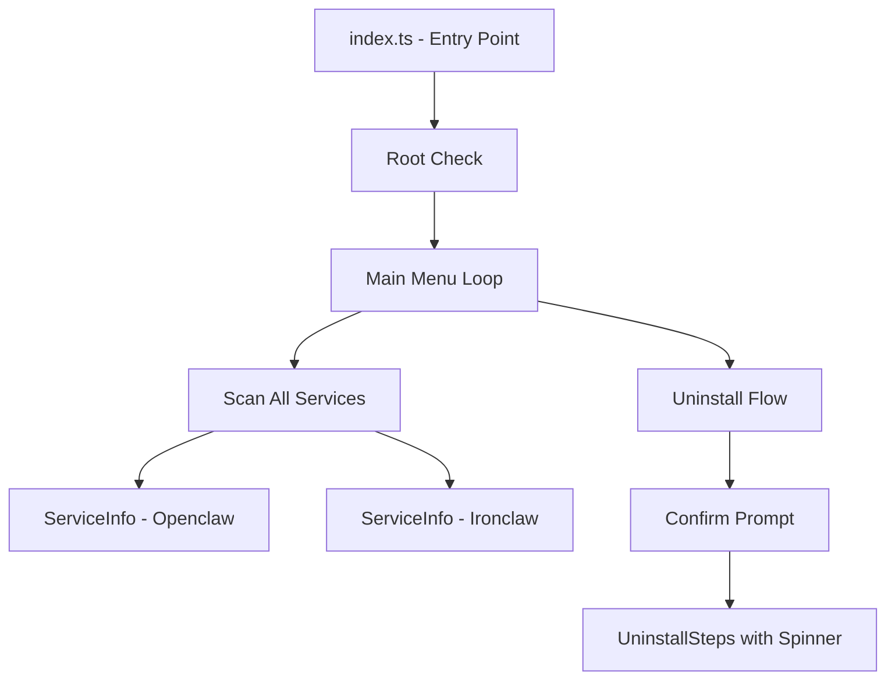

# Data Model: Noclaw Core CLI

**Branch**: `001-core-cli` | **Date**: 2026-02-17

## Entities

### ServiceInfo

Represents a monitored software service and its current system state.

| Field | Type | Description |
|-------|------|-------------|
| `name` | `string` | Display name (e.g., "Openclaw", "Ironclaw") |
| `id` | `string` | Internal identifier (e.g., "openclaw", "ironclaw") |
| `type` | `"systemd" \| "docker"` | How the service is managed |
| `installed` | `boolean` | Whether the service is detected on the system |
| `running` | `boolean` | Whether the service is currently active |

### ScanResult

Aggregated result of scanning all known services.

| Field | Type | Description |
|-------|------|-------------|
| `services` | `ServiceInfo[]` | Status of all scanned services |
| `timestamp` | `Date` | When the scan was performed |

### UninstallStep

A single atomic operation during uninstallation.

| Field | Type | Description |
|-------|------|-------------|
| `label` | `string` | Human-readable step description (shown in spinner) |
| `action` | `() => Promise<void>` | Async function that performs the operation |

### ModuleDefinition

Contract for each claw module (Openclaw, Ironclaw).

| Field | Type | Description |
|-------|------|-------------|
| `name` | `string` | Display name of the service |
| `id` | `string` | Internal identifier |
| `detect` | `() => Promise<ServiceInfo>` | Detect installation/running status |
| `remove` | `() => Promise<void>` | Execute full removal flow with confirmation |

## Relationships



## State Transitions

A service goes through these states during the uninstall flow:

```text
[Installed & Running] → [Confirm?] → Yes → [Stopping...] → [Removing...] → [Uninstalled]
                                    → No  → [No Changes]
[Not Installed]       → [Info Message: "Not found"] → [Back to Menu]
```
